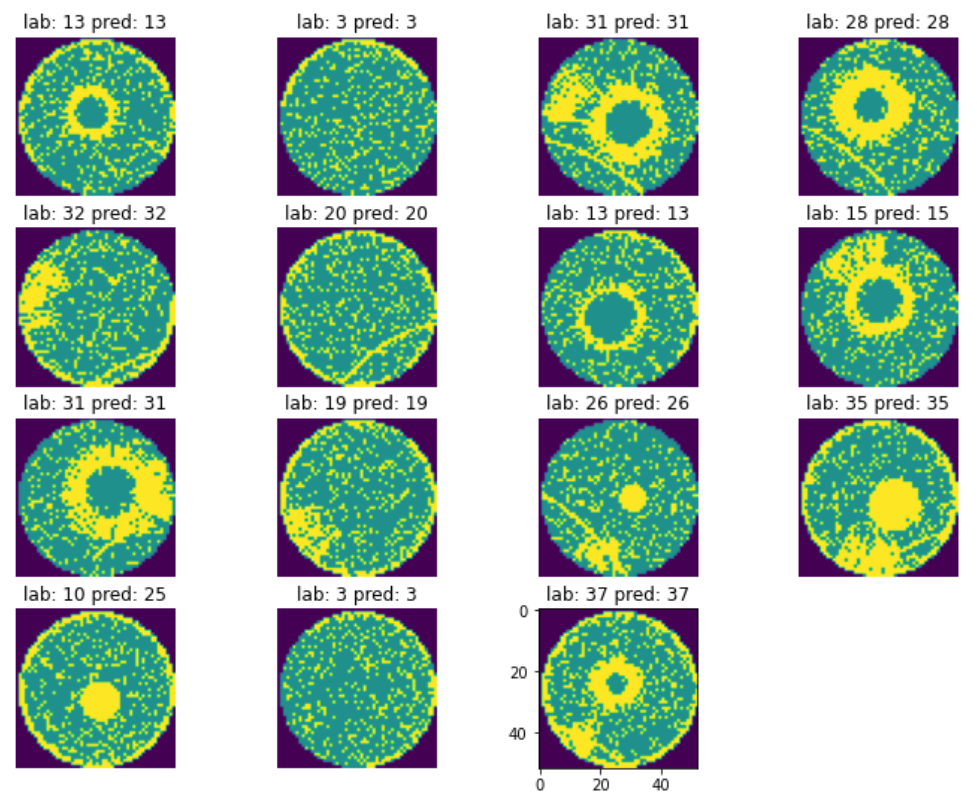

# Wafer Defect Patterns Classifier in Semiconductor Manufacturing Industry Application

## OBJECTIVE

This project aims to develop a model for accurately classification of wafer defect patterns to the known pattern types. This automation will enable efficient wafer manufacturing and quality control process, and will reduce the cost of inclusion of expert manual detection process. The accurate identification of wafer defect is important in the manufacturing and optimization process as each identified wafer defect will have the corresponding step for resolving the particular type of defect on this wafer.

## DATA

The instances that comprise the dataset are images with the size of 52 x 52, and there are 38015 instances in the dataset. They are individual images of wafer defect patterns. The data is provided by J. Wang, C. Xu, Z. Yang, J. Zhang and X. Li on behalf of Institute of Intelligent Manufacturing, Donghua University, China. The data was published on Kaggle (https://www.kaggle.com/datasets/co1d7era/mixedtype-wafer-defect-datasets)

## MODEL 
I used LeNET5 as the backbone with modifications of convolutional layers kernel sizes and addition of dropout and batchnorm layers for tuning the regulabrizations of the model.

LeNET5 is known to be simple yet powerful in image classfication problems. I am starting this project with this fundamental configuration so to minimize the potential overfitting problem but ensuring an overall good model performance.

## HYPERPARAMETER OPTIMSATION
A wrapper function was developed in this project that includes the model configuration, optimizer and training process. 

The hyperparameters used in this wrapper function are: 
1. 1st conv layer output
2. 1st conv layer kernel size
3. 2nd conv layer output
4. 2nd conv layer kernel size
5. 1st dropout rate
6. 1st fully connected layer output
7. 2nd dropout rate
8. 2nd fully connected layer output
9. 3rd dropout rate
10. Max Pooling layer kernel size
11. Max Pooling layer stride size
12. Optimizer learning rate
13. Adam weight decaying factor

Those hyperparameters are optimized using Bayesian Optimization

## RESULTS
The training accuracry for the first 5000 training data is: 91.38%
The testing accuracy for all the testing data is 90.06%

The average precision for this model on all 38 types of defects classification is 91%
The average recall for this model is also 91%.
The above figures are calculated using the confusion matrix.

The above results indicate a general good performance of my model on the dataset, without any significant overfitting / underfitting problems.

Part of the prediction results can be viewed as follows:

## CONTACT DETAILS

If you have any questions, please feel free to reach out at LinkedIn:
www.linkedin.com/in/zhichaow

## Thanks