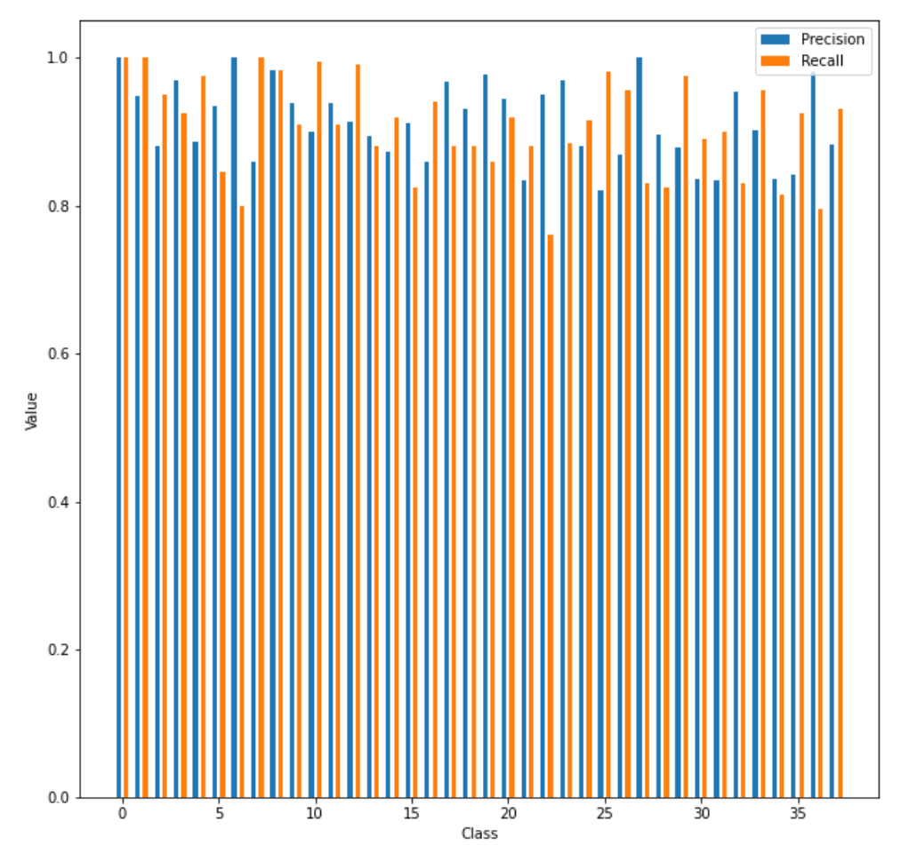

# Model Card

The model classifies each input wafer defect map into one of the 38 defect types known to the industry. This will automate the manual detecting process, improving the efficiency and reducing the cost.

## Model Description

**Input:** 52 x 52 wafer defect mapping image 

**Output:** the predicted defect type of the input wafer defect image

**Model Architecture:** LeNET5 backbone with modifications of convolutional layers kernel sizes and addition of dropout and batchnorm layers for tuning the regulabrizations of the model. 

The architecture is shown below:

## Performance

The model training / testing plot is shown below:

The black dot are training scores and the red dots are testing score / accuracty.

The accuracy is defined as the number of correctedly predicted labels over the total number of inputs

The training score is performed on the training data while the testing score is performed on the testing dataset.

As seen from the curve, the training / testing scores are balancing meaning no significant underfitting / overfitting is happening in this model for this dataset.

## Limitations

This model is trained on the dataset provided by the authors. Those dataset are in the format of 1 x 52 x 52 maps. In each map, there are different types of wafer defect patterns and the patterns are collected by measuring the electrical resistance spatial distributions across the wafers. These are the input data type and any other type of input data might not be perfoming well with this model.

## Trade-offs

Here's a presicion / recall plot for all 38 types of defect. we can see that generally the model performs well on all of the defect types prediction. 

We can see that type 6, 22 and 37 have relatively low recall score, meaning the model is relatively underperforming in predicting those particular types correctly, however, the precision for those types are particularly high. So the model has relatively unbalanced performance on predicting type 6, 22 and 37.

